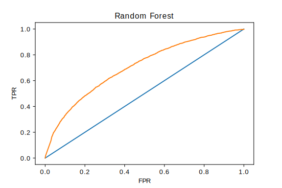

# Reddit Comment Predictive Analysis - Upvoted or Downvoted

## Overview

In this project, I analyzed comments from [Reddit's Seattle subreddit](https://reddit.com/r/Seattle) made between 2014 and 2017 to develop a model which can predict if a new comment will be upvoted or downvoted. 

## Data Source and Preprocessing

I used Google's [BigQuery](https://cloud.google.com/bigquery/) API to scrape the relevant comments, only focusing on comments with a score above +10 or below -10.  This gave me a dataset of approximately 140,000 comments, with about a 6:1 ratio of Upvoted:Downvoted comments.

I extracted meta-features like average word length and sentiment analysis of the comments and cleaned the text by removing punctuation and stopwords before converting the text to a "Bag of Words" model with n-grams from 1-3 words long.  This data was count-vectorized to allow for numerical machine learning models to be fit.

## Modeling

I attempted to use a variety of supervised learning algorithms from Logistic Regression to Naive Bayes to Support Vector Machines before deciding on a Random Forest model as the most appropriate.  Using [AWS](https://aws.amazon.com/) cloud computing power, I found the optimal model hyperparameters using Randomized Search with Cross Validation, with the area under the [ROC](https://en.wikipedia.org/wiki/Receiver_operating_characteristic) curve for out of sample data as the evaluation metric.

#### Roc Curve for the best model:

## Choosing a Threshold

As the goal for this project was to build a recommendation engine, I opted to set the threshold such that the predictions would minimize false negatives - that is, I wanted the recommender to agressively suggest that a potential comment would be downvoted, to avoid comments that *actually* will be downvoted getting through without review.

## Deployment

I built a Flask app which allows a user to enter in their potential new comment and receive a recommendation as to whether the new comment will be upvoted or downvoted.  It is hosted on AWS and can be accessed [here](http://murray.li).  Also included are [word cloud visualizations](https://github.com/jasondavies/d3-cloud) of the most common words in upvoted and downvoted comments, as well as their [relative compliments](http://murray.li/dmu.html).

## Future Develoment

I would like to employ more advanced Natural langugae processing techinques.  Supplementing the Bag of Words model could be tools like [tf-idf](https://en.wikipedia.org/wiki/Tf%E2%80%93idf).  I also would like to look more into the context of a comment, for example the topic and popularity of the post that comment is made within, as well as the direct and indirect parent comments of individual posts.

